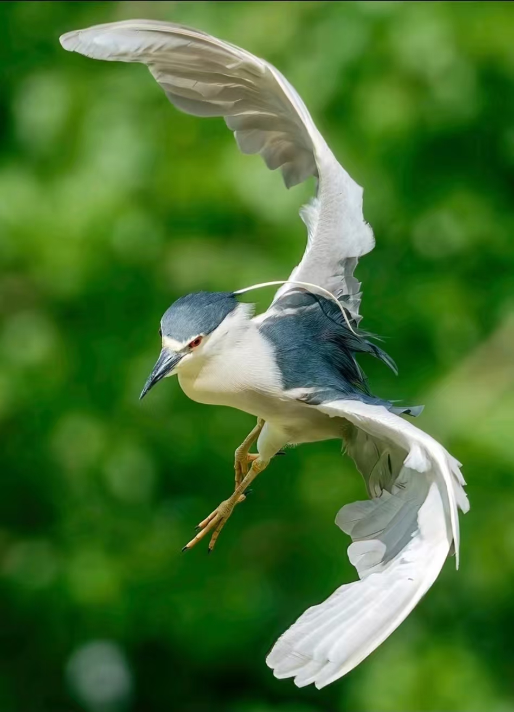
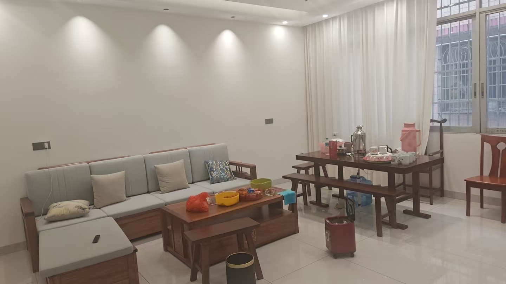
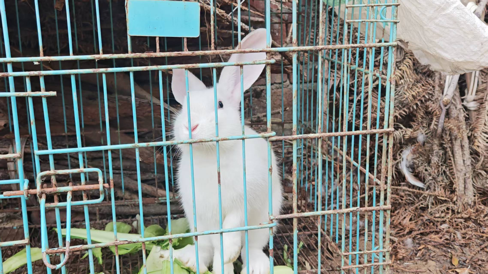
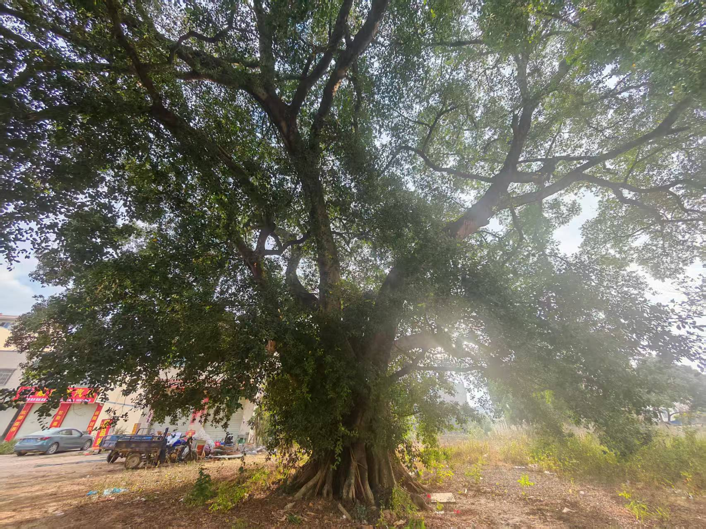

# 🎯 项目介绍

**基于 BLIP 的图像自动描述生成**是利用深度学习实现图像到自然语言的跨模态转换。本项目使用 Salesforce 提出的 BLIP (Bootstrapping Language-Image Pre-training) 模型，能够对任意图片生成准确的英文描述，并结合 Opus-MT 翻译模型将英文描述转换为中文。


---

## 📌 实验目标

1. **理解多模态学习**：掌握图像与文本两种模态如何在同一模型中联合建模
2. **掌握 Image Captioning 原理**：模型以图像为输入，自回归地逐词生成自然语言描述
3. **实践预训练模型调用**：学会使用 Hugging Face Transformers 库调用前沿多模态模型
4. **完成端到端应用**：实现图像→英文描述→中文翻译的完整流程

---

## 🖼️ 效果展示

本项目对 9 张不同场景的图片进行了测试：

| 图片 | 英文描述 | 中文翻译 |
|:---:|:---|:---|
|  | a bird flying through the air with its wings spread | 一只鸟在空中飞翔 翅膀张开 |
|  | a person in a canoe floating in a lake | 在湖中漂浮的独木舟中的人 |
|  | a small child sitting on the ground | 一个小小孩坐在地上 |
|  | a park with a lake and buildings in the background | 一个有湖和建筑在背景中的公园 |
|  | a living room with a couch, table and chairs | 客厅，有沙发、桌子和椅子 |
|  | a stuffed animal sitting on top of a bed | 坐在床顶的填充动物 |
|  | a white rabbit in a cage | 笼子里的白兔子 |
|  | a long road with cars driving down it | 一条长长的公路，车开在这条路上 |
|  | a large tree in the middle of a field | 田野中间的一棵大树 |

---

## 🛠️ 环境配置

### 1. 克隆项目

```bash
git clone https://github.com/Xiaoyi-star/Image_Captioning.git
cd Image_Captioning
```

### 2. 创建并激活虚拟环境

```bash
conda create -n blip_cap python=3.11
conda activate blip_cap
```

### 3. 安装依赖

```bash
pip install torch torchvision
pip install transformers sentencepiece sacremoses pillow matplotlib
```

> 💡 **注意**：首次运行时会自动下载模型（约 1.2GB），请保持网络畅通

---

## 🚀 使用方法

### 方法一：单张图片生成描述

```bash
python caption.py
```

修改 `caption.py` 中的图片路径即可处理其他图片：
```python
img_path = "images/your_image.jpg"  # 替换为你的图片路径
```

### 方法二：批量处理

```bash
python batch_caption.py
```

程序会自动处理 `images/` 目录下的所有图片，结果保存在 `results.txt`。

---

## 📂 项目结构

```
Image_Captioning/
├── caption.py           # 单张图片描述生成脚本
├── batch_caption.py     # 批量处理脚本
├── results.txt        # 批量处理结果
├── README.md          # 项目说明文档
├── images/            # 测试图片目录
│   ├── bird.jpg
│   ├── boat.png
│   ├── child.jpg
│   ├── lack.jpg
│   ├── livingroom.jpg
│   ├── nonver.jpg
│   ├── rabbit.jpg
│   ├── road.jpg
│   └── tree.jpg
└── __pycache__/       # Python缓存目录
```

---

## 📚 所用模型

| 模型 | 用途 | 大小 |
|:---|:---|:---|
| [Salesforce/blip-image-captioning-base](https://huggingface.co/Salesforce/blip-image-captioning-base) | 图像描述生成 | ~900MB |
| [Helsinki-NLP/opus-mt-en-zh](https://huggingface.co/Helsinki-NLP/opus-mt-en-zh) | 英译中翻译 | ~300MB |

---

## 📝 实验总结

✅ 成功实现了图像到自然语言描述的端到端生成

✅ BLIP 对常见场景（动物、室内、自然景观）有良好的描述能力

✅ Opus-MT 翻译模型能够将英文描述转换为中文

⚠️ 翻译结果存在少量语序问题，实际应用中可进一步优化

---

## 📄 License

MIT License

---

## 🙏 Acknowledgments

- [BLIP](https://arxiv.org/2201.12086) - Salesforce Research
- [Helsinki-NLP](https://huggingface.co/Helsinki-NLP) - Translation Models
- 深圳大学人工智能实验课程
